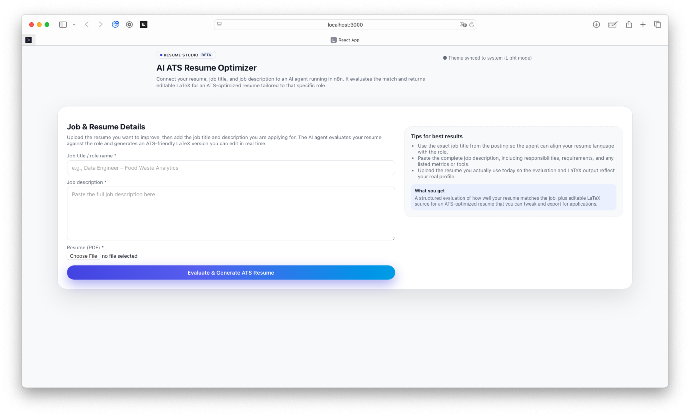
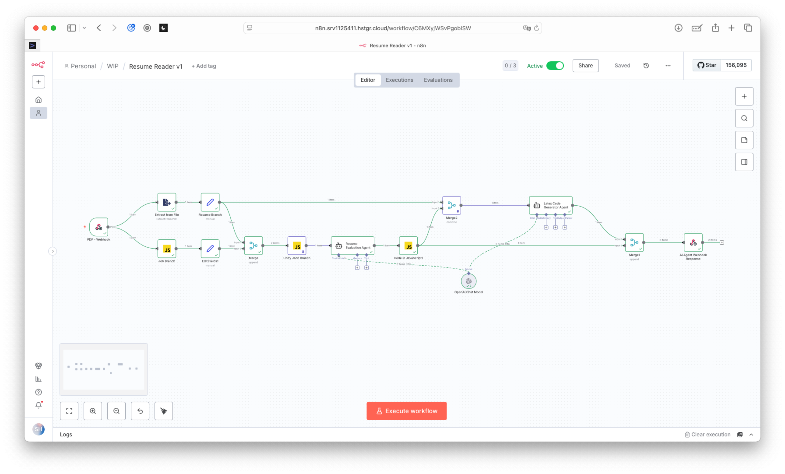

# Resume Reader - ATS Optimization Web App

An AI-powered web application that analyzes resumes against job descriptions and generates optimized, ATS-friendly LaTeX resumes with detailed feedback.

## Overview

Resume Reader helps job seekers optimize their resumes for Applicant Tracking Systems (ATS). Simply upload your resume, provide a job title and description, and receive:

- **ATS Match Score** - Comprehensive evaluation of how well your resume matches the job
- **Detailed Feedback** - Strengths, improvements needed, and keyword recommendations
- **Optimized LaTeX Resume** - AI-generated LaTeX code with real-time editing and preview
- **Professional Tips** - Actionable advice to improve your application

## Screenshots

### Job Input Form


### ATS Evaluation Results


### n8n Workflow Integration


## How It Works

1. **Input** - Enter the job title, job description, and upload your resume (PDF)
2. **AI Processing** - The app sends your data to an n8n workflow that uses AI agents to analyze and optimize
3. **Results** - Receive a detailed ATS evaluation with scoring and recommendations
4. **LaTeX Editor** - Edit and preview the AI-generated LaTeX resume in a split-pane editor

## Tech Stack

- **Frontend**: React 19.2.0
- **Backend**: n8n workflow automation with AI agents
- **LaTeX**: latex.js for document rendering
- **Styling**: Custom theme system with light/dark mode support

## Getting Started

### Prerequisites

- Node.js and npm installed
- n8n workflow endpoint configured (see `.env` file)

### Installation

```bash
npm install
```

### Development

Run the app in development mode:

```bash
npm start
```

Open [http://localhost:3000](http://localhost:3000) to view it in your browser.

### Build

Build the app for production:

```bash
npm run build
```

Builds the app to the `build` folder, optimized and minified for deployment.

## Environment Variables

Create a `.env` file in the root directory:

```
REACT_APP_N8N_WEBHOOK_URL=your_webhook_url_here
```

## Project Structure

```
src/
├── api/
│   └── upload.js          # n8n webhook integration
├── components/
│   ├── JobForm.jsx        # Job input form
│   ├── ResultPage.jsx     # Results container
│   ├── ResultEvaluation.jsx  # ATS scoring display
│   └── ResultLatex.jsx    # LaTeX editor & preview
├── styles/
│   └── themeStyles.js     # Centralized theme system
└── App.js                 # Main app with routing
```

## License

Private project - All rights reserved
